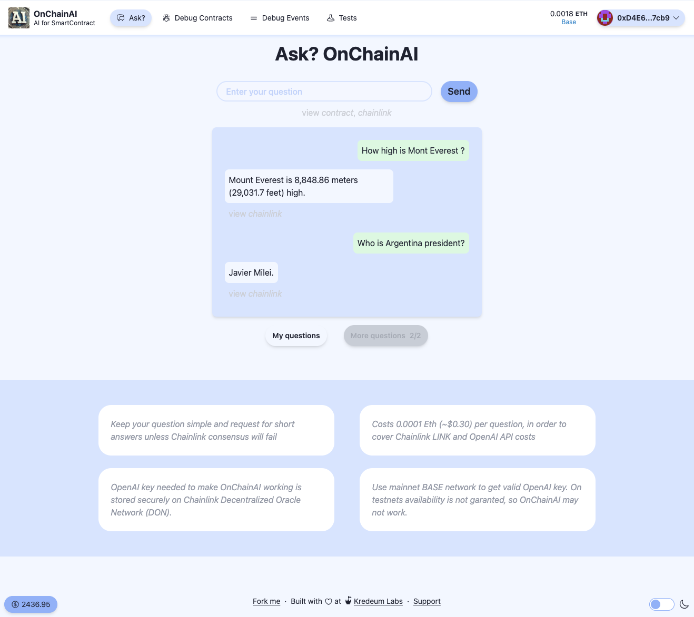

# OnChainAI 🤖

## Onchain `OpenAI` via `Chainlink Functions`
*OnChainAI purpose is to propose a fully decentralized way to interact onchain, between smartcontracts and AI*


## Demo 👀

A running demo of `OnChainAI` is available on `IPFS` : [https://onchain-ai.on-fleek.app/](https://onchain-ai.on-fleek.app/)

Here is main screenshot;




## Install 🚀

Install via these commands:

```sh
git clone https://github.com/Kredeum/onchain-ai.git
cd onchain-ai
pnpm install
```

## Setup 🛠️ (user mode)

Set these values in your ENV variables :
```sh
export PUBLIC_ALCHEMY_API_KEY=<YOUR_ALCHEMY_KEY>
export PUBLIC_WALLET_CONNECT_PROJECT_ID=<YOUR_WALLET_CONNECT_PROJECT_ID>
```

## Run 🏃

Run the Dapp on local network with this command:
```sh
turbo start
```

Or optionnaly, you can also run these commands in 3 different terminals, like in `Scaffold-eth` standard mode:
```sh
turbo chain
```

```sh
turbo deploy
```

```sh
turbo start
```

Note that `OnChainAI` will not fully work on `anvil` network (no `Chainlink` there...), so rather use a tesnet like `base-sepolia` or `optimism-sepolia` for your tests (avoid `sepolia` that is slower).


## Setup 🛠️ (advanced mode)

If you want to redeploy smartcontract (as an dev), you will also need to set these values:
- `ETHERSCAN_API_KEY=<YOUR_ETHERSCAN_API_KEY>` : etherscan api key
- `VERIFIER_URL=https://api.etherscan.io/api` : url associated with etherscan api key "
- `OPENAI_API_KEY=<YOUR_OPENAI_API_KEY>` : openai api key

`OPENAI_API_KEY` will be uploaded in a secure way to `Chainlink DON`  (don't use centralized S3 solutions also proposed by `Chainlink`)

Recommanded way is to use `direnv` command.
After [`direnv` setup](https://direnv.net/) you only have to move `example.env` with your own values to `.envrc`file

Other possible ways inludes :
- simplest way, run `source your.env`
- classic way, use `dotenv`
- chainlink secure way, use `env-enc` packages


# Details 📝 TO BE UPDATED

## Description 📗
- `OnChainAI extension` is a Scaffold-eth-alt extension, allowing you to develop Dapps using `OpenAI GPT`
- `OnChainAI` protocol is an onchain solution for any smartcontracts to make AI calls.

- `OnChainAI` uses [`OpenAI GPT4o-mini`](https://openai.com/api/) with [`Chainlink Functions`](https://functions.chain.link/).
Each `OpenAI` request launched by `OnChainAI` is sent by multiple `Chainlink` servers that have to reach consensus to return a unique answer. `Chainlink` answer can be retrieved only after a few blocks, and may take more than one minute, depending on the network.

- `OnChainAI` is not free (on mainnet) as `Chainlink` requires some `LINK` tokens and `OpenAI` requires some `$`.
Default model will be a fixed price of `0.0002 eth` per request.
BUT this will be changed in the future to a more dynamic pricing model.

- You can use `OnChainAI` protocol as is, with the contracts already deployed, or you can deploy your own, where you will be able to set your own configuration, and decide on the price of AI requests.

- `OnChainAI extension` is available with a `Hardhat` setup with 3 specific AI tasks to help you start with the `OnChainAI` protocol.

## Usage 💡

You can send your prompt to OnChainAI in different ways:
1. using `Scaffold-eth debug` page of `OnChainAI` dapp (`out of the box`)
2. using `OnChainAI UI` included in this extension, via the `Ask?` menu link in `OnChainAI` dapp
3. via your smartcontracts using `OnChainAI` protocol


## Configuration scripts 🚀

1 script is available  for the `OnChainAI` admin : `secrets`

### `secrets` script 🔒
Admin task, to be used to upload your secrets to Chainlink

Ex: `yarn hardhat --network baseSepolia ai secrets --expiration 10`

```txt
Usage: hardhat [GLOBAL OPTIONS] ai secrets [--expiration <INT>]

OPTIONS:

  --expiration	Expiration time in minutes of uploaded secrets  (default: 60)

secrets: Upload OnChainAI secrets to Chainlink
```


Config file can be found at [chainlink/config.json](chainlink/config.json)


## OpenAI 🧠

A specific `system prompt` is used for each OpenAI request, you can view it inside the javascript code run by `Chainlink DON` : [chainlink/source/onChainAI.js](chainlink/source/onChainAI.js)


## Limitations 🚧

- `Chainlink Functions` is currently in `beta` .

- `OpenAI` prompt must be kept simple, as `Chainlink Functions` has a limited memory capacity

- `OpenAI` answer must very short, in order for `Chainlink Functions` to be able to reach a consensus on an answer.
i.e. you can ask '13 time 5 equal ?' but not ask 'Tell me a story'.
And you can add to your prompt some requirements as: answer with  `one word`, `YES or NO` or `true or false`...


## Roadmap  ➡️
- implement other AI models : `Mistral`, `Claude`, `Lama3` and other `OpenAI` models
- deploy `OnChainAI` on all networks supported by `Chainlink Functions` (curently as of August 2024 : Ethereum, Arbitrum, Base, Optimism, Polygon, Avalanche)
- deploy with same address on all networks
- propose a choice between multiple system prompts
